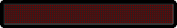

<b>► STEP 1 : CREATE SWAP FILE AND ALLOWING PORT 7070 ON FIREWALL [Copy paste below code as it is and hit enter]</b>

dd if=/dev/zero of=/mnt/myswap.swap bs=1M count=4000 && mkswap /mnt/myswap.swap && chmod 0600 /mnt/myswap.swap && swapon /mnt/myswap.swap && ufw allow 22/tcp && ufw limit 22/tcp && ufw allow 7070/tcp && ufw logging on && ufw --force enable

<b>► STEP 2 : INSTALL DEPENDENCIES REQUIRED [Copy paste below code as it is and hit enter]</b>

apt-get update -y && apt-get upgrade -y && apt-get install build-essential libssl-dev libboost-all-dev libqrencode-dev pkg-config libminiupnpc-dev qt5-default qttools5-dev-tools libgmp3-dev -y && add-apt-repository ppa:bitcoin/bitcoin -y && apt-get update -y && apt-get install libdb4.8-dev libdb4.8++-dev -y && apt-get install autoconf -y && apt-get install build-essential libtool autotools-dev pkg-config libssl-dev libboost-all-dev autoconf automake -y && apt-get install libzmq3-dev libminiupnpc-dev libssl-dev libevent-dev -y && apt-get install libgmp-dev -y && apt-get install openssl -y && apt-get update -y && apt-get install git build-essential -y && sudo apt-get install aptitude -y && sudo aptitude install libdb4.8++-dev -y && apt-get install git -y && sudo apt-get install software-properties-common python-software-properties -y && sudo add-apt-repository ppa:git-core/ppa && sudo apt-get update -y && sudo apt-get install git -y 

► <b>STEP 3 : CLONE INSTALLATION SCRIPT FROM GIT HUB</b>

git clone https://github.com/bitmoneygroup/mn-install-scrypt.git

► <b>STEP 4 : ENTER INTO FOLDER CLONED FROM GITHUB</b>

cd mn-install-scrypt

► <b>STEP 5 : GIVE READ AND WRITE PERMISSION TO DOWNLOADED MN SCRYPT FILE</b>
  
chmod 755 bitmoney.sh

► <b>STEP 6 : RUNNING AUTO INSTALL MASTERNODE SCRYPT<b/>
  
bash bitmoney.sh

-----------------------------------------------------------------------------------------------------------------------------------
Now wait for some time for configuration and installation to get complete.
-----------------------------------------------------------------------------------------------------------------------------------

► <b>STEP 7 : ENTER YOUR MASTERNODE PRIVATE KEY GENERATED FROM LOCAL WALLET</b>

THATS IT , YOUR BITMONEY MASTERNODE IS NOW RUNNING ON VPS. SIMPLY CONFIGURE YOUR LOCAL WALLET FOR MASTERNODE AND START.

<b>• KNOWN ISSUE</b>

After clicking on START ALL OR START MISSING , If you get error like "INVALID IP ADDRESS" Then do these steps as follows.

► GOTO TOOLS>DEBUG CONSOLE

► Write there the following command 

startmasternode alias false "YOUR-ALIAS-HERE"

<b> BTC DONATION ADDRESS : 1MgexxQu5wxtL2RatwmHFx61R4tgiZPjCh</b>
